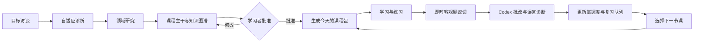

<p align="center">
  
</p>

<h1 align="center">Deep Course</h1>

<p align="center">
  <strong>把 Codex 变成课程导演，而不是一次性答案生成器。</strong><br>
  研究课程领域、设计稳定主干、生成多模态课堂、批改练习，并根据真实学习证据持续调整路径。
</p>

<p align="center">
  <code>Codex Skill</code> · <code>Adaptive Learning</code> · <code>Multimodal Lessons</code> · <code>Python Standard Library</code>
</p>

## Deep Course 是什么？

Deep Course 是一个显式调用的 Codex Skill。它不重新实现搜索、画图、代码执行、PDF 或电子表格工具，而是告诉 Codex **何时研究、如何设计课程、该生成什么教学材料，以及如何依据学习表现调整下一节课**。

它面向持续数周或数月的系统学习，而不是一次性的概念解释：

```text
目标访谈 → 自适应诊断 → 课程骨架 → 每日课程包
                                      ↓
下一节课 ← 复习队列 ← 掌握度更新 ← 练习与批改
```

> Deep Course 只有在你明确输入 `$deep-course` 时才会启动，不会把普通问答误判成长课程。

## 核心能力

| 能力 | Deep Course 的做法 |
| --- | --- |
| 课程初始化 | 询问目标、背景、时间和偏好，再用动态难度诊断建立起点 |
| 课程架构 | 先研究整个领域，只生成稳定的课程主干和知识依赖图 |
| 每日教学 | 根据进度、旧错题和到期复习，聚焦研究并生成当天课程 |
| 多模态材料 | 按教学价值调用 Codex 的图表、图片、代码、PDF 和电子表格能力 |
| 交互练习 | 在静态 `lesson.html` 中完成客观题、查看即时反馈并导出答案 |
| 深度批改 | 由 Codex 批改开放题、诊断误区、安排补救课或挑战课 |
| 自适应路径 | 保持学习目标和核心模块稳定，同时调整课序、节奏与复习频率 |
| 可恢复状态 | 用确定性的 Python 标准库脚本校验、原子更新并保护课程状态 |

## 一节课不只是 Markdown

每节课固定包含六个核心文件：

```text
lessons/007-bonds/
├── lesson.html       # 主要学习界面
├── lesson.md         # 可读、可版本控制的课程正文
├── exercises.md      # 练习
├── answers.md        # 答案与评分标准
├── sources.md        # 来源、证据与不确定性
└── state.json        # 脚本维护的课程清单和生命周期
```

只有在确实提高学习效果时，才会额外生成：

```text
assets/               # 图示、图片、图表
data/                 # 数据集
workbook.xlsx         # 可修改的电子表格实验
lesson.pdf            # 打印或离线版本
simulation/           # 少数复杂课题需要的本地交互实验
```

默认课程是完全静态、可离线打开的 HTML。只有复杂模拟真正值得额外成本时，才会生成本地服务项目。

## 完整学习闭环



课程主干不会被模型随意重写。Codex 可以插入补救课或挑战课、调整节奏和复习安排；重大课程变更会先向学习者说明并等待批准。

## 安装

### 使用 Codex Skill Installer

在 Codex 中输入：

```text
$skill-installer 安装这个 Skill：
https://github.com/edocF/Deep-Course-Skill/tree/main/deep-course
```

### 手动安装

将仓库中的 `deep-course` 目录复制到 Codex Skills 目录：

```text
$CODEX_HOME/skills/deep-course/
```

如果没有设置 `CODEX_HOME`，默认位置通常是：

- Windows：`%USERPROFILE%\.codex\skills\deep-course`
- macOS / Linux：`~/.codex/skills/deep-course`

安装后重新加载 Codex，使 Skill 出现在可用技能列表中。

## 快速开始

创建课程：

```text
$deep-course 我想系统学习金融投资。我有基础数学知识，每天可以学习 35 分钟，
目标是理解资产定价、读懂财务报表，并能建立长期投资策略。
```

Deep Course 会先完成简短访谈和诊断，然后研究领域、提交课程骨架并等待你的批准。它不会一口气生成几十节质量逐渐下降的课程。

批准课程后，可以直接使用自然语言：

```text
$deep-course 开始今天的课
$deep-course 我完成了练习，这是我的答案……
$deep-course 查看我的进度和待复习内容
$deep-course 今天只有 15 分钟，给我轻量课程
$deep-course 这个模块太简单了，给我安排一次挑战课
```

默认课程保存在当前工作区：

```text
courses/<course-slug>/
├── course.json
├── curriculum.json
├── progress.json
├── attempts.jsonl
├── syllabus.md
├── knowledge-map.md
├── research/
└── lessons/
```

也可以在调用时指定其他目录。

## 三种学习时长

| 模式 | 时间 | 适合场景 |
| --- | ---: | --- |
| `light` | 约 15 分钟 | 忙碌日、复习、单一小概念 |
| `normal` | 30–45 分钟 | 默认模式，完整讲解、案例与练习 |
| `deep` | 60–90 分钟 | 复杂主题、综合案例、数据实验 |

课程长度由真实学习活动控制，而不是“生成多少字”。一节 `normal` 课程通常包含检索练习、新概念、可视化、真实案例、问题求解和最后回忆。

## 研究与来源原则

Deep Course 采用两层研究：

1. **建课研究**：理解整个领域、核心标准、知识依赖和课程边界。
2. **每日研究**：只为当前课题寻找最相关的教材、官方资料、大学课程、论文或权威数据。

事实、数据和真实案例需要可追溯来源，并在必要时交叉验证。纯概念解释不会为了显得“有依据”而机械堆砌引用；无法确认的信息会明确标注不确定性，而不是编造结论。

## 状态与安全边界

`deep-course/scripts/course_state.py` 是课程状态的唯一确定性写入层：

- 仅使用 Python 标准库，运行时无需第三方依赖；
- 校验课程 ID、知识依赖、时间戳、掌握度和复习证据；
- 使用原子文件替换，失败时尽量保持原始字节不变；
- 拒绝绝对路径、目录穿越、未知 Schema 和损坏状态；
- 用稳定 ID 和重放保护实现可恢复、幂等的更新；
- 将“完成一课”和“掌握知识”分开记录，避免虚假的学习进度。

公开命令行入口：

```text
python deep-course/scripts/course_state.py init --root PATH --slug SLUG --title TITLE --created-at ISO8601
python deep-course/scripts/course_state.py validate --root PATH
python deep-course/scripts/course_state.py next-session --root PATH --now ISO8601
```

尝试记录、掌握度更新和课程生命周期由 Skill 通过同一模块的确定性 Python 接口完成。

## 项目结构

```text
deep-course/
├── SKILL.md                         # 课程导演与操作路由
├── agents/openai.yaml               # 显式调用策略与界面元数据
├── references/
│   ├── onboarding-and-curriculum.md
│   ├── lesson-design.md
│   ├── research-and-sources.md
│   ├── assessment-and-adaptation.md
│   └── state-contracts.md
├── scripts/course_state.py          # 确定性状态引擎
├── assets/lesson-template/
│   └── lesson.html                  # 可访问、可打印的交互课程模板
└── tests/                            # 状态、模板、包结构与场景验证
```

## 开发与验证

运行时不需要安装依赖。完整测试中的 Skill 包检查使用 PyYAML：

```bash
python -m pip install pyyaml
python -m unittest discover -s deep-course/tests -p "test_*.py"
```

当前测试覆盖课程初始化、损坏状态、路径约束、原子更新、尝试记录、掌握度、间隔复习、课程文件完整性、生命周期、HTML 答题导出和显式调用策略。

## 设计原则

- **Codex 已经足够强**：Skill 负责导演，不再包装一层 Agent Framework。
- **先搭骨架，再生成今天**：长期课程保持全局一致，每节课保留足够研究预算。
- **用活动控制时间**：课程时长来自学习、观察、计算和回忆，而不是字数。
- **教学价值优先**：不是每课都需要图片或 Excel，但需要时就生成真正可操作的产物。
- **证据驱动适应**：错误、提示次数、开放题表现和延迟回忆共同决定下一步。
- **学习者掌握重大方向**：课程重构与目标变化始终需要明确批准。

---

## English overview

Deep Course is an explicitly invoked Codex Skill for sustained, adaptive learning. It uses Codex's native research and artifact capabilities to build a stable curriculum, generate one high-quality multimodal lesson at a time, assess learner work, schedule retrieval practice, and adapt the next session from durable evidence.

It deliberately ships without a domain curriculum, external agent framework, direct LLM API, or third-party runtime dependency. Invoke it with `$deep-course`, describe what you want to learn, and approve the proposed curriculum before the first normal lesson is generated.

```text
$deep-course Build me a 12-week distributed systems course.
I can study for 35 minutes a day and want hands-on exercises.
```

See [`deep-course/SKILL.md`](deep-course/SKILL.md) for the director workflow and [`deep-course/references/`](deep-course/references/) for the complete contracts.
